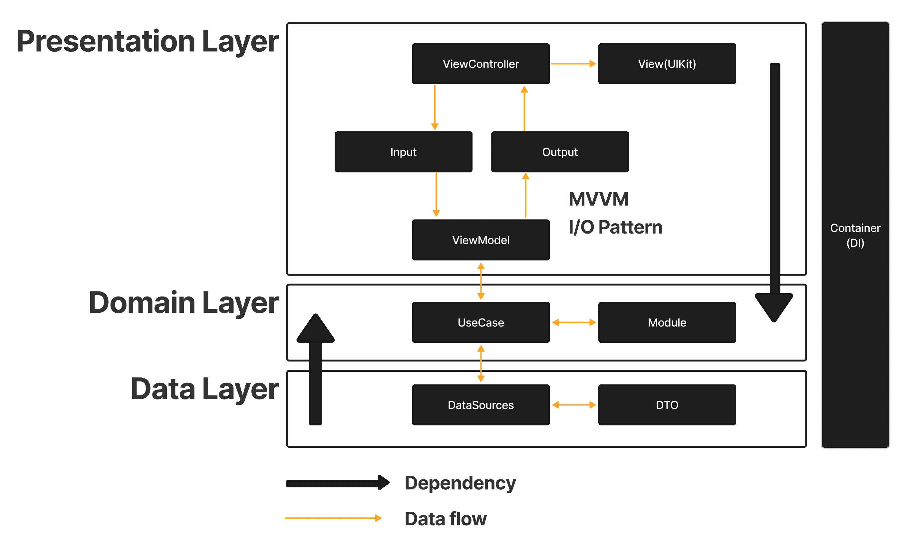

# WeatherList

  ## Requirements
  - Seoul, London, Chicago, 세 도시의 날씨를 표시하는 앱이에요. 
  - 위 도시 순서대로 오늘을 포함한 6일 간의 날씨를 표시해주세요.
  - 총 3개 도시의 각 6일간의 날씨를 한 화면에 표시해주세요.

---

  ## Useage
  ```
  $ pod install && xed .
  ```
    
  ## Libraries
  |Name|Description|
  |---|---|
  |SnapKit|Auto Layout을 쉽게 만듭니다.|
  |RxSwift|관찰 가능한 시퀀스를 사용하여 비동기 및 이벤트 기반 프로그램을 구성하기 위한 라이브러리입니다.|
  |RxCocoa|Cocoa Framework에 Rx기능을 합친 RxSwift 래퍼 입니다.|
  |RxDataSources|테이블뷰와 컬렉션뷰의 DataSource 오브젝트 관리를 쉽게 관리하도록 합니다.|
  |RxAppState|View Controller 의 Life Cycle 이벤트를 관찰할 수 있도록 합니다.|
  |RxTest|RxSwift의 스트림들을 테스트 할 수 있고 가상 시간을 함께 이벤트를 발생시킬 수 있도록 합니다.|
  |RxNimble/RxTest|Nimble의 expect라는 함수로 명료하게 테스트를 할 수 있도록 합니다.|

  > RxTest, RxNimble은 Project의 Tests target에서만 사용(import) 할 수 있도록 pod file에 명시합니다.
 
  ## Project

  

  *CleanArchitecture + MVVM(I/O pattern)*

  ### Presentation Layer
  - View, ViewModel이 포함되며 ViewModel의 Input Output을 통해 ViewController와 상호작용합니다.
  
  ### Domain Layer
  - 가장 안쪽의 Layer로 외부 Layer의 구현을 모르는 순수한 Business logic(Domain UseCase, Entities)가 포함됩니다. 또한 Data Layer에서 받아온 Entitiy를 Domain Model로 변환해줄 수 있는 Mapper인 Translator가 존재합니다.

  ### Data Layer
  - Domain UseCase의 실질적인 Implementation가 존재하며 하나 이상의 Repositories 포함됩니다. 또한 데이터를 전달할 때 Data Transfer Objects(DTO)를 사용하여 JSON의 response를 Entity로 변환합니다.

 > 각 Layer의 Dependency는 Podspec File에 정의되어 Target으로 분리되어 있습니다.

  ### etc..

   ### App
   - App의 시작점인 @main, Project Resourcesr가 포함됩니다.
   
   ### Utils 
   - Namespace, Extension등이 포함됩니다.

   ### Infrastructure
   - Network통신을 위한 Implementation가 포함됩니다.
   
   ### Container
   - Dependency Injection Container가 포함되며, PropertyWrapper를 통한 Injected Wrapper가 존재합니다.

   ### Test(Unit Test)
   - ViewModel의 로직을 검증하 기존 코드의 유효성을 검증하며, 코드 추가시에 발생할 수 있는 사이드 이팩트를 줄일 수 있는 Test Case들이 포함됩니다.

  ## Tree

```
WeatherList
├── App
│   └── AppDelegate.swift
└── Resources
    ├── Assets.xcassets
    │   ├── AccentColor.colorset
    │   │   └── Contents.json
    │   ├── AppIcon.appiconset
    │   │   └── Contents.json
    │   ├── Contents.json
    │   └── icons
    │       ├── 01.imageset
    │       │   ├── 01.svg
    │       │   └── Contents.json
    │       ├── 02.imageset
    │       │   ├── 02.svg
    │       │   └── Contents.json
    │       ├── 03.imageset
    │       │   ├── 03.svg
    │       │   └── Contents.json
    │       ├── 04.imageset
    │       │   ├── 04.svg
    │       │   └── Contents.json
    │       ├── 09.imageset
    │       │   ├── 09.svg
    │       │   └── Contents.json
    │       ├── 10.imageset
    │       │   ├── 10.svg
    │       │   └── Contents.json
    │       ├── 11.imageset
    │       │   ├── 11.svg
    │       │   └── Contents.json
    │       ├── 13.imageset
    │       │   ├── 13.svg
    │       │   └── Contents.json
    │       ├── 50.imageset
    │       │   ├── 50.svg
    │       │   └── Contents.json
    │       ├── Contents.json
    │       └── na.imageset
    │           ├── Contents.json
    │           └── na.svg
    ├── Base.lproj
    │   └── LaunchScreen.storyboard
    ├── ChicagoFiveDays.json
    ├── Info.plist
    ├── LondonFiveDays.json
    ├── Secrets.plist
    └── SeoulFiveDays.json

Modules
├── Container
│   ├── Container
│   │   ├── Container.h
│   │   └── Sources
│   │       ├── DI
│   │       │   └── DependencyInjection.swift
│   │       └── InjetedPropertyWrapper.swift
│   └── Container.podspec
├── Data
│   ├── Data
│   │   ├── Data.h
│   │   └── Sources
│   │       ├── Entities
│   │       │   └── FiveDaysWeatherDTO.swift
│   │       ├── Mock
│   │       │   ├── LondonFiveDays.json
│   │       │   └── MockFetchWeatherList.swift
│   │       ├── Translator
│   │       │   └── FiveDaysWeatherTranslator.swift
│   │       └── UseCase
│   │           └── FetchWeatherListImpl.swift
│   └── Data.podspec
├── Domain
│   ├── Domain
│   │   ├── Domain.h
│   │   └── Sources
│   │       ├── Entities
│   │       │   └── FiveDaysWeather.swift
│   │       └── UseCases
│   │           └── FetchWeatherList.swift
│   └── Domain.podspec
├── Infrastructure
│   ├── Infrastructure
│   │   ├── Infrastructure.h
│   │   └── Sources
│   │       ├── GetSecrets
│   │       │   └── GetSecrets.swift
│   │       ├── Mocking
│   │       │   └── MockClient.swift
│   │       └── Networking
│   │           ├── APIClient
│   │           │   └── APIClient.swift
│   │           ├── HTTPMethod.swift
│   │           └── RequestBuilder
│   │               └── RequestBuilder.swift
│   └── Infrastructure.podspec
├── Presentation
│   ├── Presentation
│   │   ├── Presentation.h
│   │   └── Sources
│   │       ├── View
│   │       │   └── WeatherListCell.swift
│   │       ├── ViewController
│   │       │   └── WeatherListVC.swift
│   │       └── ViewModel
│   │           └── WeatherListVM.swift
│   └── Presentation.podspec
└── Utils
    ├── Utils
    │   ├── Sources
    │   │   ├── Extension.swift
    │   │   └── URLBuilder
    │   │       ├── Components
    │   │       │   ├── CombinedComponent.swift
    │   │       │   ├── EmptyComponent.swift
    │   │       │   ├── Host.swift
    │   │       │   ├── Path.swift
    │   │       │   ├── Query.swift
    │   │       │   ├── Scheme.swift
    │   │       │   └── URLComponent.swift
    │   │       └── RURLBuilder.swift
    │   └── Utils.h
    └── Utils.podspec
```
